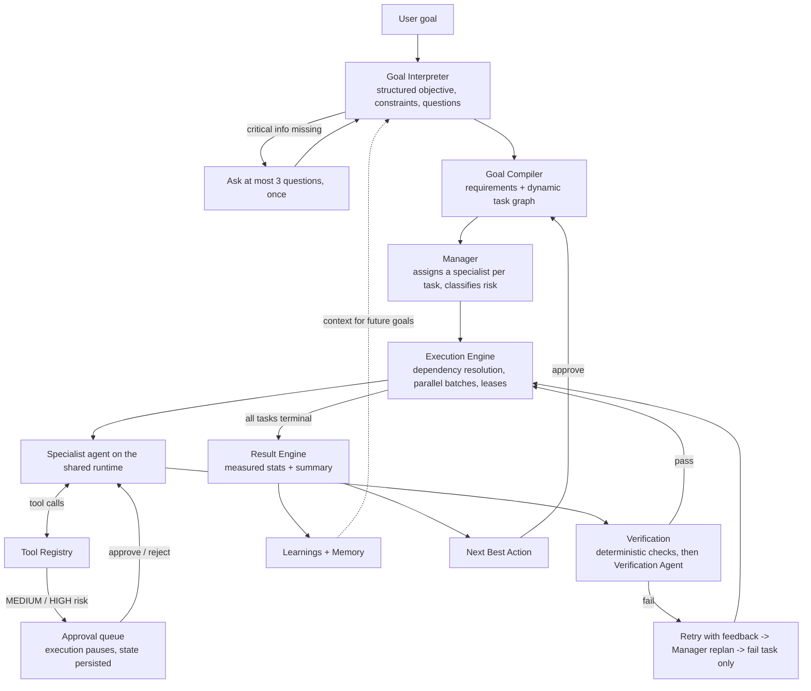

# AI Workforce

**Tell AI what you want. It figures out how to get it done.**

AI Workforce is a Goal → Action → Result platform. You state a goal in plain language; the system interprets it, compiles it into a dependency graph of tasks, assigns specialist agents, executes with real tools, verifies every output, pauses for human approval when an action is risky, and reports a result with a recommended next step.

There are no agents to configure, no prompts to write and no workflows to draw.

## How it works



Everything between "User goal" and "Result" is persisted in PostgreSQL. The UI is a live view of that state, streamed over Server-Sent Events.

## Features

| Area | What is implemented |
| --- | --- |
| Goal Interpreter | Natural language → `{objective, constraints, target, deadline, knownContext, missingInformation}`. Asks only critical questions (max 3, one round), otherwise proceeds on stated assumptions. |
| Goal Compiler | Model-planned requirements and task graph, different for every goal. Output is normalized and validated (unique keys, known tools only, acyclic) and gets one repair attempt before the goal fails clearly. |
| Task engine | Durable tasks with dependencies, priority, status (`PENDING, READY, RUNNING, WAITING_APPROVAL, COMPLETED, FAILED, BLOCKED, CANCELLED`), retries, cost, verification report. |
| Manager | Deterministic, explainable agent assignment by task type and required tools. On permanent failure decides to replace the task (replan) or abandon it. |
| Agents | Research, Strategy, Writing, Creative, Analytics, Finance, Marketing on one shared runtime; Verification and Manager as engine roles. |
| Tools | `web_search`, `http_request`, `save_document`, `read_documents`, `memory_search`, `memory_save`, `send_email`, `calculator`, `generate_image`, `workspace_analytics`. Tools without credentials report themselves unavailable; nothing is simulated. |
| Risk engine | LOW runs automatically. MEDIUM pauses at the tool call (reviewer sees the exact payload). HIGH is gated before the task starts **and** at each HIGH tool call. |
| Approvals | Persisted requests and decisions, audit-logged. Execution resumes from saved agent state; an approved action runs exactly once, a rejected one never runs and the agent is told why. |
| Execution | Dependency resolution, parallel batches, per-task timeouts, retries, cancellation, crash recovery via database leases, time-sliced for serverless. |
| Verification | Deterministic checks (output exists, substantive, not truncated, no placeholders, required external action confirmed by the tool log), then an independent Verification Agent judging the output against acceptance criteria, upstream inputs and tool logs. |
| Results | Measured stats (tasks, time, tokens, cost, retries), narrative summary, deliverables, Next Best Action with Approve / Dismiss. Approving plans follow-up tasks on the same goal. |
| Learning | Structured records (`observation, pattern, confidence, context, recommendation`) extracted from each execution record and fed into later planning. No fake ML. |
| Memory | Seven categories (USER, PROJECT, PREFERENCE, DECISION, DOCUMENT, ACTION, RESULT). Inspectable and editable in the UI. USER and PREFERENCE memories are private to their owner. |
| Cost control | Every model call metered (tokens, estimated cost, latency, purpose). Per-goal budget enforced before each call. Caps on tasks, retries, agent iterations, replans, parallelism and time. |
| Security | Scrypt password hashing, hashed session tokens in HttpOnly SameSite cookies, Origin check on mutations, workspace isolation on every query, zod validation, database-backed rate limiting, SSRF protection on URL fetching, security headers, audit log. |
| Observability | Execution event log per goal, agent runs, tool calls, usage records, audit log, all visible in the UI, plus structured JSON server logs. |

## Tech stack

- **Next.js 16** (App Router, React 19, Turbopack), TypeScript strict
- **PostgreSQL** with **Drizzle ORM**; embedded **PGlite** for local development and tests
- **Tailwind CSS 4**
- AI providers behind one interface: **Anthropic** (official SDK), **OpenAI**, **DeepSeek** (OpenAI-compatible)
- **Vitest** for unit and integration tests

## Project layout

```
src/
  ai/            Provider abstraction (generate / stream / structuredOutput), pricing, metering + budget
  agents/        Agent definitions, shared runtime (tool loop, approvals, resumable state), manager
  engine/        interpreter, compiler, plan normalization, graph, risk, executor, verification,
                 result + learning, events, service layer (approvals, cancel, resume), drive (time slices)
  tools/         Tool interface, registry, SSRF guard, calculator
  memory/        Structured memory service with permissions
  db/            Drizzle schema and connection (Postgres or embedded PGlite)
  lib/           env, auth, http helpers (errors, CSRF, rate limit), logging
  app/           Pages and API routes
  components/    Command Center UI
drizzle/         SQL migrations
tests/           Unit + engine integration tests
```

## Local development

Requirements: Node.js 22+, pnpm.

```bash
pnpm install
cp .env.example .env.local   # add at least one AI provider key
pnpm dev
```

Open http://localhost:3000 and create a workspace. With no `DATABASE_URL`, an embedded Postgres (PGlite) is created under `.data/` and migrated automatically. It is for development only.

> If your shell already exports `OPENAI_BASE_URL` (for example to a gateway), it applies here too. System environment variables take precedence over `.env.local`.

## Environment variables

Full list with comments: [.env.example](.env.example).

| Variable | Required | Purpose |
| --- | --- | --- |
| `DATABASE_URL` | Production | PostgreSQL connection string |
| `ANTHROPIC_API_KEY` / `OPENAI_API_KEY` / `DEEPSEEK_API_KEY` | One of them | AI provider credentials |
| `AI_PROVIDER`, `AI_MODEL`, `AI_FAST_MODEL` | No | Provider and model selection |
| `OPENAI_BASE_URL`, `AI_PRICING_JSON` | No | OpenAI-compatible endpoint; price overrides |
| `ENGINE_SECRET` | Recommended | Authenticates the engine's self-invocation endpoint |
| `CRON_SECRET` | Recommended on Vercel | Authenticates the sweep cron |
| `APP_URL` | No | Public base URL (defaults to `VERCEL_URL`) |
| `ALLOW_SIGNUPS` | No | `false` closes signups after the first account |
| `TAVILY_API_KEY` | No | Enables `web_search` |
| `RESEND_API_KEY`, `EMAIL_FROM` | No | Enables `send_email` |
| `OPENAI_IMAGE_MODEL` | No | Image model for `generate_image` (needs `OPENAI_API_KEY`) |
| `GOAL_BUDGET_USD`, `MAX_TASKS_PER_GOAL`, `MAX_TASK_RETRIES`, `MAX_AGENT_ITERATIONS`, `MAX_REPLANS_PER_GOAL`, `MAX_PARALLEL_TASKS`, `TASK_TIMEOUT_MS`, `GOALS_PER_HOUR` | No | Limits and cost control |

Secrets are only read on the server (`src/lib/env.ts` is `server-only`). The Settings page shows which integrations are configured, never their values.

## Database

```bash
pnpm db:generate   # after changing src/db/schema.ts: writes a new SQL migration to drizzle/
pnpm db:migrate    # applies migrations to DATABASE_URL
```

Tables: `users, sessions, workspaces, workspace_members, goals, goal_requirements, tasks, task_dependencies, agent_runs, tool_calls, approvals, memories, documents, execution_events, results, learnings, recommendations, usage_records, audit_logs, rate_limits`.

## Testing

```bash
pnpm lint
pnpm typecheck
pnpm test
pnpm build
```

- **Unit**: goal parsing, graph validation and dependency resolution, plan normalization, risk classification, verification checks, result stats, agent assignment, pricing, calculator, SSRF, password hashing.
- **Integration** (real engine against embedded Postgres, with a scripted model provider used only in tests): goal → task graph, task → agent, agent → tool, approval → resume (approve, reject, HIGH-risk gating), verification failure → retry → replan, budget halt → resume, crash recovery, lease exclusivity, cancellation, workspace isolation, memory permissions, rate limiting.
- **End to end**: "Create a launch plan for my SaaS." from interpretation through result and next best action.

## Production deployment (Vercel)

1. Import the repository in Vercel. The framework is detected as Next.js; `vercel.json` sets the build command to `pnpm vercel-build`, which applies database migrations and then builds.
2. Add a PostgreSQL database (for example Neon from the Vercel Marketplace) so `DATABASE_URL` is set for Production and Preview.
3. Add environment variables: one AI provider key, `ENGINE_SECRET`, `CRON_SECRET`, and any tool credentials.
4. Deploy.

Runtime notes:

- **Long-running goals.** A serverless invocation is time-limited, so the engine runs a goal in time slices (`maxDuration` 300s). State is in the database; a lease guarantees one runner per goal. When a slice ends with work remaining, the engine invokes `/api/internal/engine` to continue. If that hand-off cannot happen, an open goal page nudges the engine, and a daily cron (`/api/cron/sweep`) restarts anything stalled.
- **Streaming.** `/api/goals/:id/stream` is SSE on the Node.js runtime. It reads the persisted event log, so it works across instances and resumes with `Last-Event-ID`.
- **Preview deployments** with Vercel Deployment Protection block the engine's self-invocation; goals still progress while their page is open. Either disable protection for the preview or set `APP_URL` to an unprotected domain.
- Use a **pooled** connection string; the client runs with `prepare: false` for transaction poolers.

## Limitations

- Integrations are deliberately few: email (Resend), web search (Tavily), generic HTTP, images (OpenAI). There are no native connectors for CRMs, social networks, ad platforms or CMSs yet, so goals that imply those produce ready-to-use assets and hand-off steps instead of performing the action.
- Memory retrieval is by category and recency plus keyword search. There are no embeddings / pgvector yet.
- Learnings are extracted by the model from each execution record and stored with a confidence value; there is no statistical aggregation across goals yet.
- One workspace per user in the UI (the schema supports members; there is no invite flow).
- Costs are estimates from token counts at list prices; models without a known price use a conservative fallback and are flagged.
- The SSRF guard validates resolved addresses before each request and on every redirect; it does not pin the connection to the validated address.

## Future integrations

The tool interface (`src/tools/types.ts`) is the extension point: a tool declares its input schema, risk level, availability check and `execute`. Candidates: Slack, Gmail/Outlook, HubSpot/Salesforce, LinkedIn/X publishing, Google Analytics, Stripe (HIGH risk), GitHub, Notion, Vercel deploys, and MCP servers as a generic tool source.
